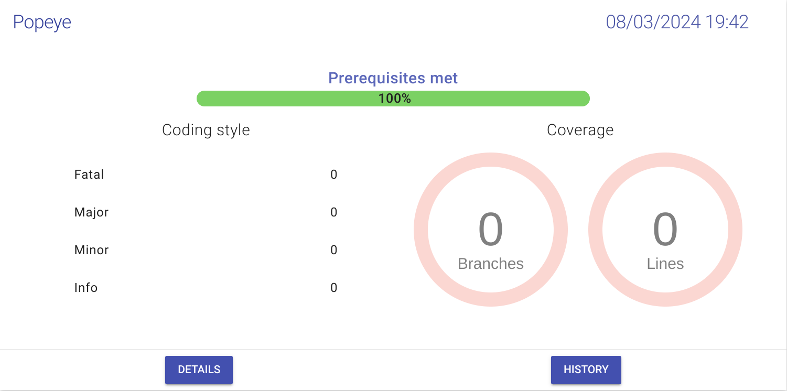

# POPEYE ~ Epitech Docker-Project
DevOps module final grade: A

# How to run the project
```
$ docker-compose up
```

# Description
Understand the basics of docker:
  - configure envrionment variables
  - create images
  - build images

# Results

